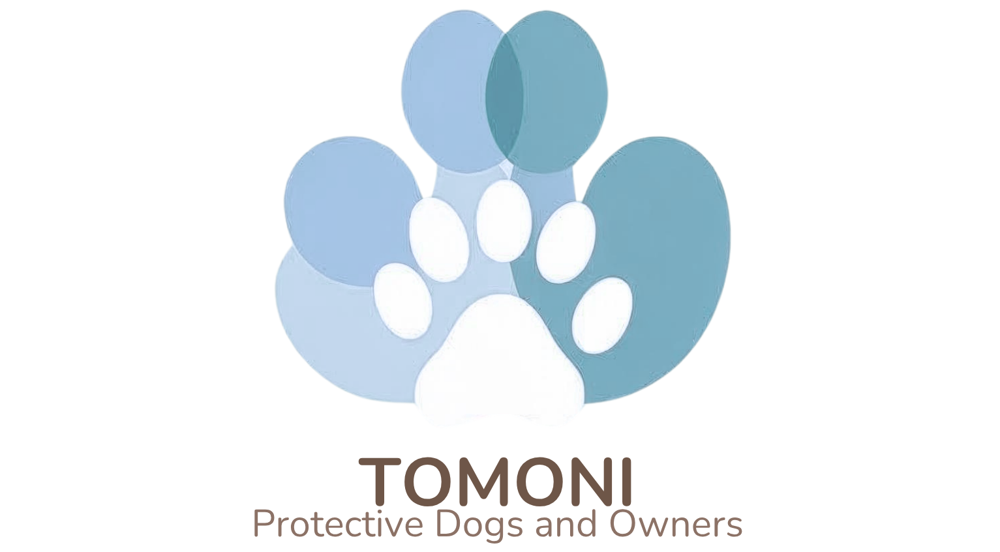

# 「TOMONI」

 

### サービスURL:　https://tomoni-dogs.com

# 🐕 サービス概要

保護犬と、保護犬と暮らす飼い主さんを、日々の悩みや不安から支えるサポートアプリです。
飼い主同士の情報交換やAIとの相談機能を通じて、気軽に相談・共有ができます。

「迎えた後も、ずっと一緒に幸せに暮らせるように」——安心できる居場所とつながりを提供するサービスです。

## 💙「TOMONI」への思い

私自身、保護犬を迎えた経験があります。

迎えた子が新しい環境に馴染めず体調を崩したり、私が出かけるとずっと吠え続けたり、皮膚にできものを見つけて「これは前からあったもの？病院に行くべきかな？」と不安になることが多くありました。そんな時、気軽に譲渡元の保護団体に相談したい、他の飼い主さんがどうしているか知りたい、と思いました。

しかし、相談のハードルは高く、「どこにも聞けない」という状況になりました。悩みや不安を気軽に共有できる場所がほしいと感じました。

実際に、迎えた後に様々な理由で再度保護犬に戻ってしまうことも少なくありません。悩みや不安がが原因で飼い主が孤立し、最悪の場合、保護犬がまた不幸な境遇に戻ってしまうことを防ぎたいと強く感じました。

「保護犬を迎えること」だけでなく、
「暮らし続けること」をサポートしたい。

その思いから、このアプリを作ろうと決めました。

## 👪 使っていただきたい方

- **現在、保護犬と暮らしている飼い主さん**
    →実際に暮らしてみて出てくる悩みを抱えている方や他の保護犬飼い主はどのように生活しているのか知りたい方。
    
- **これから保護犬を迎えようとしている方**
    →事前に情報や体験談を知ることで、迎え入れる心の準備ができると思います。気軽に相談できる場所があることで保護犬を飼うことへのハードルが低くなります。
    
- **保護団体**
    →巣立った保護犬が今どのように生活しているのか状況を見ることができることで、アドバイスなどを具体的に行うことができます。実際に幸せに過ごしている保護犬をみていただきたいです。

## 🦴主要な機能
- AI相談機能
- チャット
- お悩み相談
- 日記

| AI相談機能 |
| :---: | 
|  |
| 
新規入力フォームから相談することができます。前の質問がある場合は右上の「前の相談から選択」をクリックすると相談一覧が表示されます。
 |
 

 | チャット　|
 | :---: | 
 ||
 |チャットはActionCableを使用しており、リアルタイムで行うことができます。また既読機能もついています。|
 

 | お悩み相談　|
 | :---: | 
 ||
 |お悩み相談は似ているお悩みを下部に表示する仕組みとなっています。また、お悩み相談・日記は、リアクションやコメントを残すことができます。|

 | うちの子日記　|
 | :---: | 
 ||
 |自分の日記は「うちの子日記」から見ることができます。カレンダーに日記を記載した日は「日記🐾」と記載されます。それをクリックするとその日の日記詳細を見ることができます。|

## その他の機能

 | 通知機能　|
 | :---: | 
 ||
 |通知もリアルタイムで届きます。通知内容をクリックするとその画面に遷移することができます|

 | フォロー機能　|
 | :---: | 
||
|お悩み相談や日記などのユーザー名をクリックするとプロフィールページに遷移できます。フォローするボタンがあるのでクリックするとフォローすることができます。|

## 🔧 技術構成について

## 使用技術

| カテゴリ | 技術内容 |
| --- | --- | 
| サーバーサイド | Ruby on Rails 7.2・Ruby 3.2.2 |
| フロントエンド | Ruby on Rails・JavaScript |
| CSSフレームワーク | Tailwindcss + daisyUI |
| Web API | OpenAI API(GPT-4)・LINE Developers |
| データベースサーバー | PostgreSQL |
| ファイルサーバー | AWS S3 |
| アプリケーションサーバー | Render |
| バージョン管理ツール | GitHub・Git Flow |

## ER図
https://app.diagrams.net/#G1Y_xF8MzAA6Rsq63JYV_J8H0dY-_8v_5G#%7B%22pageId%22%3A%22R2lEEEUBdFMjLlhIrx00%22%7D

## 画面遷移図
https://www.figma.com/design/P6devOz4R6ubTSnxw8J6TR/TOMONI
